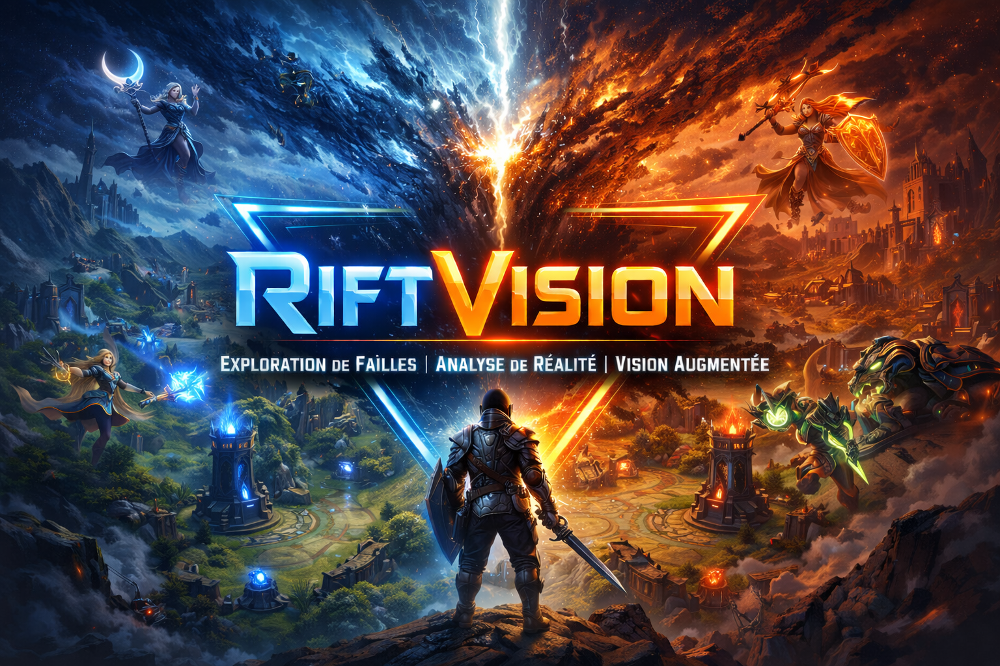

<a name="readme-top"></a>

<!-- PROJECT SHIELDS -->
[![Contributors][contributors-shield]][contributors-url]
[![Forks][forks-shield]][forks-url]
[![Stargazers][stars-shield]][stars-url]
[![Issues][issues-shield]][issues-url]
[![MIT License][license-shield]][license-url]
[![LinkedIn][linkedin-shield]][linkedin-url]

<!-- ABOUT THE PROJECT -->
# 🎮 RiftVision

<p align="center">
  <a href="http://localhost:3000">
    
  </a>
</p>

### ℹ️ Description

**RiftVision** est un copilote web « second screen » pour **League of Legends**, conçu pour afficher des alertes dynamiques et des informations tactiques en temps réel sur un second écran ou une tablette, **sans overlay intrusif en jeu**.

- 🧭 **Connexion directe** : Dialogue local avec la **Live Client Data API** officielle de Riot (`https://127.0.0.1:2999`).
- ⚡ **Stack moderne** : Nuxt 4 (Vue 3), TypeScript, Tailwind CSS et Nuxt UI.
- 🧹 **Outillage performant** : **Biome** pour le linting et le formatage ultra-rapide.
- 🧪 **Qualité & Tests** : Tests unitaires via **Vitest** et tests E2E via **Playwright**.
- 🐳 **Docker ready** : Conteneurisé avec support réseau hôte pour joindre le client LoL (`host.docker.internal`).
- 🎮 **Mode Simulation / Mock** : Jeu de données réel embarqué pour tester et développer sans partie active.

---

## ⚖️ Conformité Riot Games & Fair Play

RiftVision est conçu dans le respect strict des **Riot Games Developer Policies** :
1. **Aucune injection mémoire ni altération de client** : L'application n'injecte aucun code et ne lit pas la mémoire du jeu. Elle consulte uniquement l'API locale HTTP mise à disposition par Riot Games pendant les parties.
2. **Pas d'avantage déloyal (*Unfair Advantage*)** : Toutes les informations affichées proviennent exclusivement des données publiques délivrées par l'API officielle (aucune information cachée par le brouillard de guerre n'est révélée illégalement).
3. **Mention légale obligatoire** :
   > *RiftVision isn't endorsed by Riot Games and doesn't reflect the views or opinions of Riot Games or anyone officially involved in producing or managing Riot Games properties. Riot Games, and all associated properties are trademarks or registered trademarks of Riot Games, Inc.*

---

## 🚀 Progression & Roadmap

- [x] **v0 — Socle, Infra & Interfaçage API**
  - [x] Configuration Nuxt 4 + Biome + Docker
  - [x] Typage TypeScript exhaustif de la Live Client Data API
  - [x] Client HTTP serveur avec gestion du certificat SSL auto-signé de Riot
  - [x] Endpoints API (`/api/riot/status`, `/api/riot/live`, `/api/riot/events`, `/api/riot/mock`)
  - [x] Console de diagnostic second screen avec bascule Mode Simulation (Mock)
  - [x] Suite de tests unitaires Vitest et tests E2E Playwright
- [ ] **v0.5 — Collecte, Moteur de Diff & Dashboard Brut**
  - [ ] Moteur de diff temps réel (détection de nouveaux kills, items achetés, structures tombées)
  - [ ] Tableau de bord comparatif Équipe Bleue vs Équipe Rouge (golds, KDA, items)
  - [ ] Journal d'événements dynamique
- [ ] **v1 — Expérience Second Screen Complète**
  - [ ] Moteur d'inférence de zones (déduction Top/Mid/Bot/Jungle/Rivière)
  - [ ] Minimap vectorielle interactive avec pins dynamiques
  - [ ] Alertes visuelles grand format temporaires
  - [ ] Alertes sonores contextuelles via Web Audio API

---

## 💻 Installation & Démarrage

### Prérequis
* Node.js $\ge$ 20.x
* League of Legends (sur la même machine pour le mode réel) ou utilisation du mode simulation intégré

### Option A : Lancer en local

```bash
# 1. Cloner le dépôt
git clone https://github.com/nlabrazi/riftvision.git
cd riftvision

# 2. Installer les dépendances
npm install

# 3. Lancer le serveur de développement
npm run dev
# L'application est disponible sur http://localhost:3000
```

### Option B : Lancer avec Docker

```bash
docker compose up --build
# L'application est disponible sur http://localhost:3000
```

---

## 🛠️ Scripts Disponibles

| Commande | Description |
| :--- | :--- |
| `npm run dev` | Démarre le serveur Nuxt en mode développement |
| `npm run build` | Compile l'application pour la production |
| `npm run lint` | Exécute le linter **Biome** sur l'ensemble du code |
| `npm run format` | Formate le code avec **Biome** |
| `npm run format:check` | Vérifie le formatage sans modifier les fichiers (idéal pour la CI) |
| `npm run test` | Exécute la suite de tests unitaires avec **Vitest** |
| `npm run e2e` | Exécute la suite de tests End-to-End avec **Playwright** |

---

## 📄 Licence & Contact

Distribué sous licence **MIT**. Voir `LICENSE.txt` pour plus d'informations.

- 👤 **Nabil Labrazi** : [Portfolio](https://nabil-labrazi.fr) • [LinkedIn](https://linkedin.com/in/nabil-labrazi) • [Email](mailto:na.labrazi@gmail.com)

[contributors-shield]: https://img.shields.io/github/contributors/nlabrazi/riftvision.svg?style=for-the-badge
[contributors-url]: https://github.com/nlabrazi/riftvision/graphs/contributors
[forks-shield]: https://img.shields.io/github/forks/nlabrazi/riftvision.svg?style=for-the-badge
[forks-url]: https://github.com/nlabrazi/riftvision/network/members
[stars-shield]: https://img.shields.io/github/stars/nlabrazi/riftvision.svg?style=for-the-badge
[stars-url]: https://github.com/nlabrazi/riftvision/stargazers
[issues-shield]: https://img.shields.io/github/issues/nlabrazi/riftvision.svg?style=for-the-badge
[issues-url]: https://github.com/nlabrazi/riftvision/issues
[license-shield]: https://img.shields.io/github/license/nlabrazi/riftvision.svg?style=for-the-badge
[license-url]: https://github.com/nlabrazi/riftvision/blob/master/LICENSE.txt
[linkedin-shield]: https://img.shields.io/badge/-LinkedIn-black.svg?style=for-the-badge&logo=linkedin&colorB=555
[linkedin-url]: https://linkedin.com/in/nabil-labrazi
